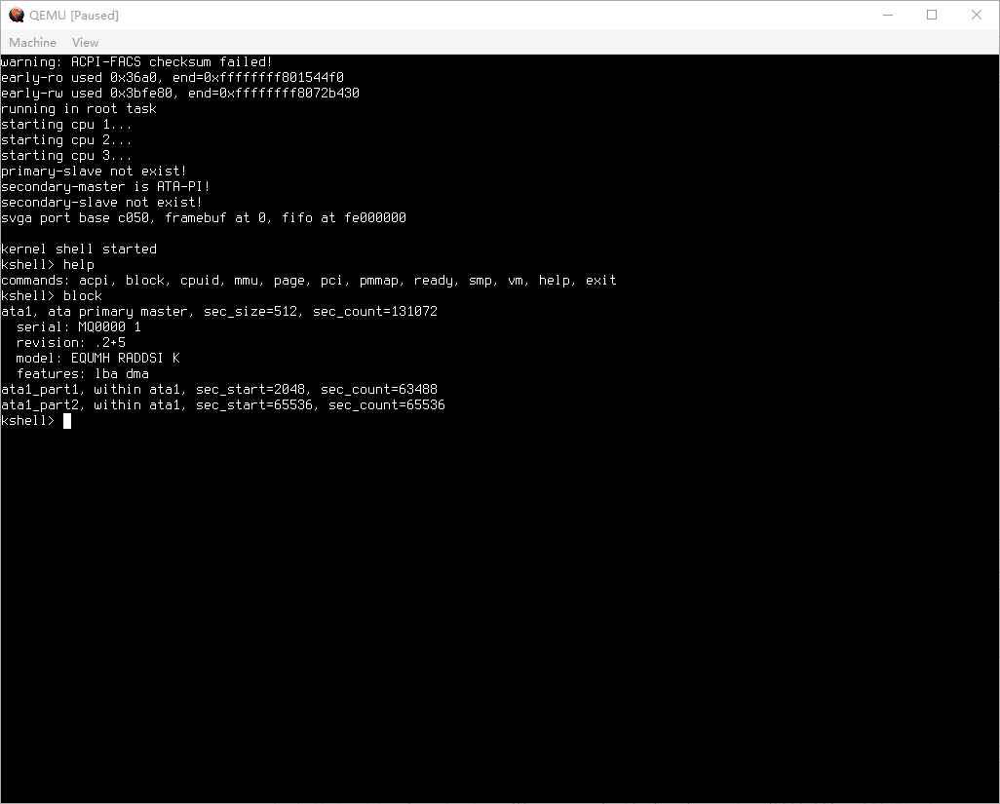

# Wheel Operating System

Wheel is an operating system, written from scratch.

64-bit higher half kernel, multiprocessor support, preemptive scheduling, ring-0 only, simple kernel shell.



## prepare toolchain

Create docker image for compiling kernel and generating bootable image.

```bash
cat host_tools/Dockerfile | docker build - -t osdev --build-arg NJOBS=8
```

You can also check `host_tools/Dockerfile` for envsetup instructions.

## build and test

```bash
make        # compile kernel elf image build/wheel.elf
make iso    # create bootable iso image build/wheel.iso
make test   # compile unit test binary build/test
make cov    # run unit test and generate coverage report in build/cov
```

Launch QEMU using `./run_iso.sh` (or `run_iso.bat` under Windows).
