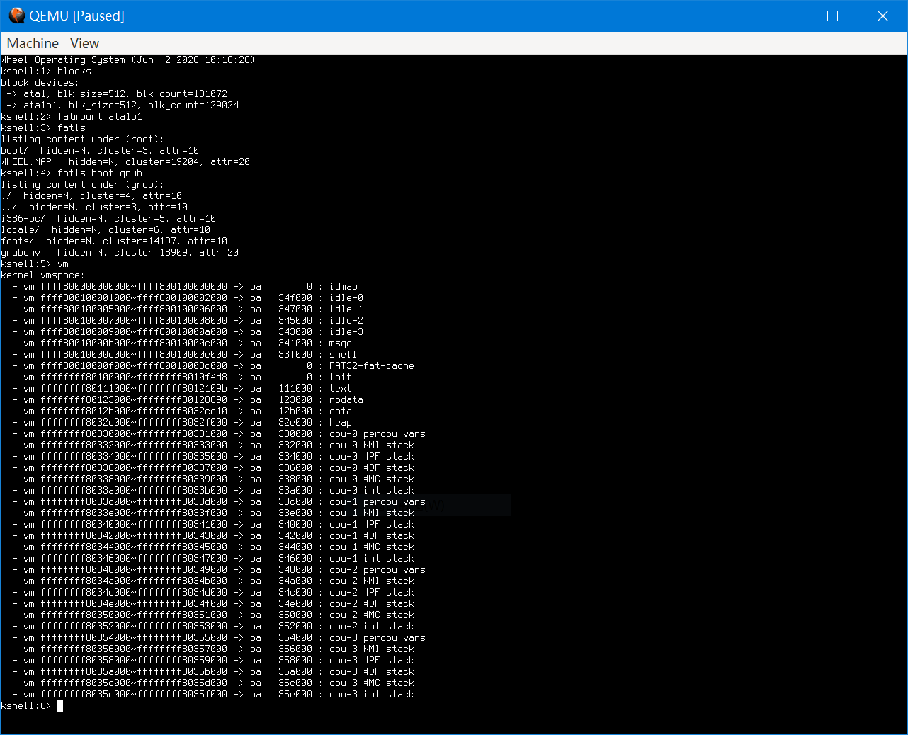

# Wheel Operating System


Wheel is an operating system for x86_64, written from scratch.

## Features

- **64-bit higher-half kernel** with per-CPU data (GS segment)
- **Multiprocessor support** — APIC, per-CPU run queues, IPI-based TLB shootdown
- **Preemptive scheduling** — 32 priority levels, round-robin within same priority, load balancing
- **User mode (ring-3)** — ELF loading, process address spaces, syscall entry/exit
- **IPC** — semaphore, mutex, message queue (msgq)
- **Virtual memory** — per-process page tables, on-demand physical allocation, copy-on-write ready
- **Synchronization** — MCS (Mellor-Crummey-Scott) queue-based spinlocks with lockdep
- **Kernel object framework** (kobj) — reference counting, named lookup, automatic cleanup
- **Kernel heap** (best-fit with red-black tree), **SLUB-style object pool**
- **Buddy system** physical page allocator with page coloring
- **FAT32 filesystem** support (read-only)
- **Interactive kernel shell** with debug commands

## Build and Test

Wheel is built with LLVM (clang + ld.lld) using GNU Make.
See [how to build the toolchain](./docs/00_build_toolchain.md).

```bash
make          # build kernel ELF and user programs → build/wheel.elf
make iso      # create bootable ISO → build/cd.iso
make kunit    # build unit test binary → build/kunit
make kcov     # run unit tests + HTML coverage report → build/coverage
make clean    # remove build/
```

`DEBUG=1` is the default; pass `DEBUG=0` for optimized builds. `ARCH` defaults to `x86_64`.

On Windows, prefix with `wsl` (all build commands require a Linux environment).

## Run in QEMU

```bash
./run_iso.sh    # Linux/macOS
run_iso.bat     # Windows
```

A bootable disk image can be created with `./host/mkimage build/hd.img`.
Copy files into it: `mcopy -i "build/hd.img@@1M" <file> ::/`.

## Screenshots



## build and test

Wheel is build using LLVM under Linux, ses [how to build toolchain](./docs/00_build_toolchain.md).

```bash
make        # build kernel elf image build/wheel.elf
make iso    # create bootable iso image build/wheel.iso
make unit   # build unit test binary build/unit
make cov    # run unit test and generate coverage report in build/coverage
```

## run in emulator

Create disk image by `sudo ./host/mkimage build/hd.img`.

Copy file into disk image: `mcopy -i "build/hd.img@@1M" path_to_file ::/`

Launch QEMU using `./run_iso.sh` (or `run_iso.bat` under Windows).
